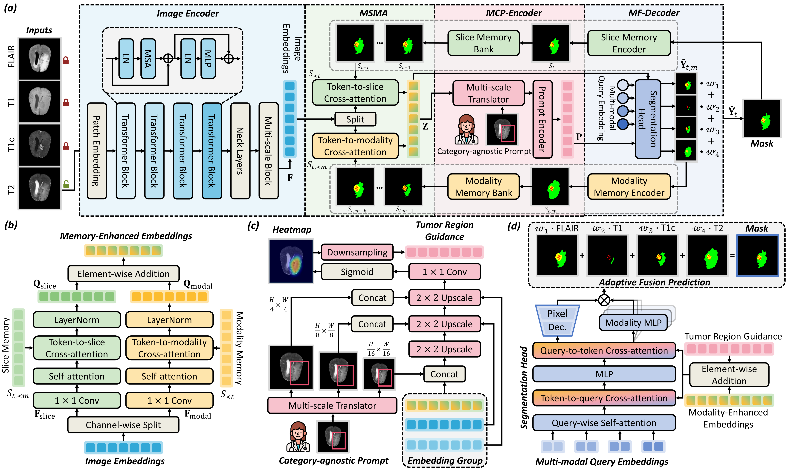

# *MSM-Seg*: A Modality-and-Slice Memory Framework with Category-Agnostic Prompting for Multi-Modal Brain Tumor Segmentation

[[`arXiv`](https://arxiv.org/abs/2510.10679)] 

[Yuxiang Luo]()<sup>1*</sup> [Qing Xu](https://scholar.google.com/citations?user=IzA-Ij8AAAAJ&hl=en&authuser=1)<sup>2,5*</sup> [Hai Huang]()<sup>3</sup> [Yuqi Ouyang]()<sup>4</sup> [Xiangjian He]()<sup>5</sup> [Zhen Chen](https://franciszchen.github.io/)<sup>6✉</sup> [Wenting Duan](https://scholar.google.com/citations?user=H9C0tX0AAAAJ&hl=zh-CN&authuser=1)<sup>7</sup> [Jiebo Luo]()<sup>8</sup>

<sup>1</sup>Waseda University &emsp; <sup>2</sup>University of Nottingham &emsp; <sup>3</sup>Northeast Agricultural University &emsp; <sup>4</sup>Sichuan University &emsp;

<sup>5</sup>University of Nottingham Ningbo China &emsp; <sup>6</sup>The Hong Kong Polytechnic Universit &emsp; <sup>7</sup>Univeristy of Lincoln &emsp; <sup>8</sup>University of Rochester &emsp;

<sup>*</sup> Equal Contribution.  <sup>✉</sup> Corresponding Author. 

-------------------------------------------

## 📰News
- **[2025.10.12]** We have released the code for MSM-Seg!

## 🛠Setup

Our code is built on top of a customized **SAM2** backbone (shipped in this repo under `sam2_train/`) and tested with **Python 3.10 + PyTorch 2.3.1 + CUDA 12.1** on NVIDIA A6000 GPUs. Other compatible versions should also work.

**1. Clone the repository**
```bash
git clone https://github.com/<your-account>/MSM-Seg.git
cd MSM-Seg
```

**2. Create a conda environment**
```bash
conda create -n msmseg python=3.10 -y
conda activate msmseg
```

**3. Install PyTorch** (pick the command matching your CUDA version; example for CUDA 12.1)
```bash
pip install torch==2.3.1 torchvision==0.18.1 --index-url https://download.pytorch.org/whl/cu121
```

**4. Install the remaining dependencies**
```bash
pip install monai SimpleITK nibabel numpy opencv-python einops \
            hydra-core omegaconf imageio matplotlib pandas \
            tensorboardX tqdm wandb huggingface_hub python-dateutil
```
> The customized SAM2 backbone lives in `sam2_train/` and is imported directly from the repository root, so no extra installation is required. Just make sure you launch all scripts from the project root directory.

**5. Download the SAM2 pretrained checkpoint**

We initialize the image encoder with the official SAM2 weights. The paper uses **Hiera-Small**:
```bash
mkdir -p checkpoints
wget https://dl.fbaipublicfiles.com/segment_anything_2/072824/sam2_hiera_small.pt -P checkpoints/
```
The matching config is `sam2_hiera_s` (`-sam_config sam2_hiera_s`). Tiny / Large variants are also available via `sam2_hiera_t` / `sam2_hiera_l` (download `sam2_hiera_tiny.pt` / `sam2_hiera_large.pt` from the same URL prefix).

## 📚Data Preparation
- **BraTS**: [Challenge Link](https://www.synapse.org/brats2024)
The data structure is as follows.
```
MSM-Seg
├── brats2024_met
│   ├── data
│     ├── BraTS-MET-00001-000
          ├──BraTS-MET-00001-000-seg.nii
          ├──BraTS-MET-00001-000-t1c.nii
          ├──BraTS-MET-00001-000-t1n.nii
          ├──BraTS-MET-00001-000-t2f.nii
          ├──BraTS-MET-00001-000-t2w.nii
|     ├── ...
|   ├── data_split.json
```
The json structure is as follows.
    { 
     "train": ['BraTS-MET-00674-000',...],
     "valid": ['BraTS-MET-00283-000',...],
     "test":  ['BraTS-MET-00674-000',...] 
     }

## 🎪Quickstart

The full pipeline is: **download → preprocess → train → test**. All commands are run from the project root.

### 1. Download the dataset (optional)
We provide the preprocessed-ready BraTS release on Hugging Face. Edit `local_download_dir` (and your Hugging Face access token) at the top of `download.py`, then:
```bash
python download.py
```

### 2. Preprocessing
Preprocessing resizes every volume to `256×256` in-plane, applies brain-region **z-score normalization** to each of the 4 modalities, and caches each case as a compressed `.npz` (`imgs` of shape `[4, 256, 256, Z]` and `mask` of shape `[256, 256, Z]`).

`process.py` expects the dataset in **nnU-Net v2 layout** (the four modalities encoded as `_0000`–`_0003`):
```
Dataset102_met/
├── imagesTr/
│   ├── BraTS-MET-00001-000_0000.nii.gz   # t1c
│   ├── BraTS-MET-00001-000_0001.nii.gz   # t1n
│   ├── BraTS-MET-00001-000_0002.nii.gz   # t2w
│   ├── BraTS-MET-00001-000_0003.nii.gz   # t2f
│   └── ...
├── labelsTr/
│   └── BraTS-MET-00001-000.nii.gz        # segmentation label
├── imagesTs/                             # test images (same _0000.._0003 naming)
├── labelsTs/                             # test labels
└── preprocessed/                         # created by process.py (one .npz per case)
```
Run preprocessing:
```bash
python process.py -data_path /path/to/Dataset102_met -image_size 256
```
> Training/testing scan `imagesTr/` and `imagesTs/` automatically (by `*_0000.nii.gz`) — no split file is required.

### 3. Training
MSM-Seg follows a **category-agnostic** design: a single *whole-tumor* box prompt jointly predicts the three nested sub-regions — **WT (Whole Tumor) / TC (Tumor Core) / ET (Enhancing Tumor)** — each as a binary mask. There is no need for per-class prompts.

The easiest entry point is `run.py`, which launches multi-GPU training and then runs testing automatically:
```bash
# Box-prompt mode (one whole-tumor box -> WT/TC/ET), 4 GPUs
python run.py -prompt bbox -gpus 0,1,2,3 -data_path /path/to/Dataset102_met
```
Use `-prompt None` for the prompt-free (automatic) mode, and `-skip_test` to train only.

To launch training directly with `torchrun`:
```bash
# Multi-GPU (4 GPUs)
CUDA_VISIBLE_DEVICES=0,1,2,3 torchrun --nproc_per_node=4 train_3d.py \
    -prompt bbox -exp_name brats_MedSAM2_ALL \
    -sam_ckpt checkpoints/sam2_hiera_small.pt -sam_config sam2_hiera_s \
    -dataset brats -data_path /path/to/Dataset102_met

# Single GPU
CUDA_VISIBLE_DEVICES=0 torchrun --nproc_per_node=1 train_3d.py \
    -prompt bbox -exp_name brats_MedSAM2_ALL \
    -sam_ckpt checkpoints/sam2_hiera_small.pt -sam_config sam2_hiera_s \
    -dataset brats -data_path /path/to/Dataset102_met
```
Checkpoints are saved to `outputs/epoch_{N}_{tag}.pth`.

**Key hyper-parameters** (default values; see `cfg.py` and `conf/settings.py`):
| Option | Meaning | Default |
| --- | --- | --- |
| `-sam_config` | image encoder (`sam2_hiera_t/s/l`) | `sam2_hiera_s` (Hiera-Small) |
| `-prompt` | prompt mode: `bbox` (whole-tumor box) / `None` (prompt-free) | `None` |
| `-lr` | initial learning rate (AdamW, warmup + cosine) | `1e-4` |
| `-video_length` | number of slices per training clip | `8` |
| `EPOCH` (in `conf/settings.py`) | total training epochs | `300` |

> `-target_class` is only used as a **naming tag** for the experiment / checkpoint — all three regions (WT/TC/ET) are always trained and evaluated jointly.

### 4. Testing / Evaluation
`run.py` automatically picks the latest checkpoint and reports per-class metrics:
```bash
python run.py -skip_train -prompt bbox -gpus 0 -data_path /path/to/Dataset102_met
```
Or run testing directly:
```bash
python test_3d.py -prompt bbox -exp_name brats_MedSAM2_ALL \
    -sam_ckpt outputs/epoch_299_ALL.pth -sam_config sam2_hiera_s \
    -dataset brats -data_path /path/to/Dataset102_met
```
Evaluation reports **Dice** and **HD95** for **WT / TC / ET** (and their average), following the BraTS protocol. Predicted masks are saved as `.nii.gz` together with per-slice PNG visualizations under the experiment directory.

### (Optional) Data sanity check
To detect unreadable / problematic cases before training:
```bash
python delete.py -data_path /path/to/Dataset102_met
```

## Acknowledgements
* [SAM2](https://github.com/facebookresearch/sam2)
* [MedSAM2](https://github.com/bowang-lab/MedSAM2)
* [nnUNet](https://github.com/MIC-DKFZ/nnUNet)
## Citation
```
@misc{luo2025msmsegmodalityandslicememoryframework,
      title={MSM-Seg: A Modality-and-Slice Memory Framework with Category-Agnostic Prompting for Multi-Modal Brain Tumor Segmentation}, 
      author={Yuxiang Luo and Qing Xu and Hai Huang and Yuqi Ouyang and Zhen Chen and Wenting Duan},
      year={2025},
      eprint={2510.10679},
      archivePrefix={arXiv},
      primaryClass={cs.CV},
      url={https://arxiv.org/abs/2510.10679}, 
}
```
